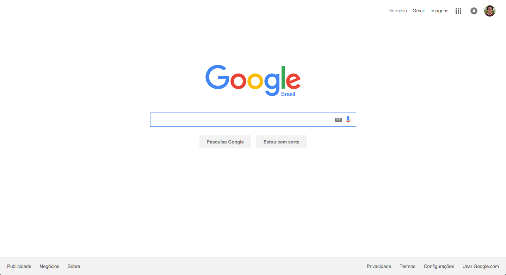

# Google Homepage Project - Easy Version

HTML/CSS Challenge for the Odin Project.

[View my solution in browser](https://rawgit.com/herminiotorres/easy-version-google-homepage/master/index.html)

[Find the project page here](http://www.theodinproject.com/web-development-101/html-css?ref=lnav)

### Run project local machine

If you want to run a local http server, just run this command in the project folder:

```shell
$ python -m SimpleHTTPServer 3456
```

then just open your default browser and access the URL: `http://localhost:3456`

### Preview


